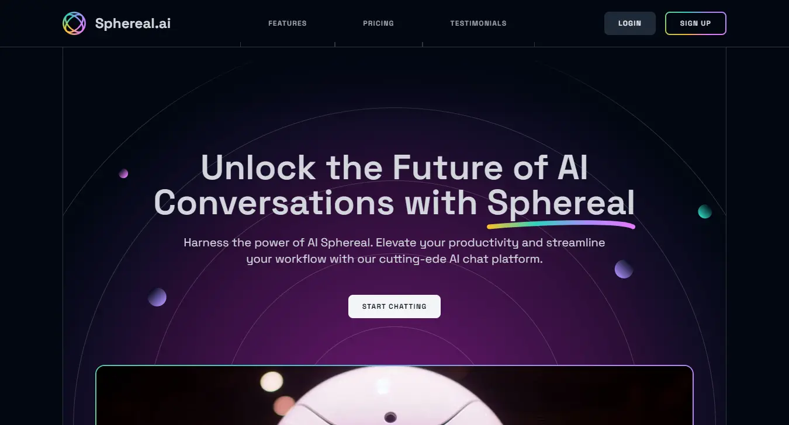

# Sphereal-AI Landing Page



This project is based on the AI SaaS landing page starter template provided by Frontend Tribe, and I followed their tutorial to complete the development of the site.

## Getting Started

First, install the dependencies:

```bash
npm install
# or
yarn
# or
pnpm install
```

Then, run the development server:

```bash
npm run dev
# or
yarn dev
# or
pnpm dev
```

Open the provided URL with your browser to see the result and start coding along with the video tutorial.
